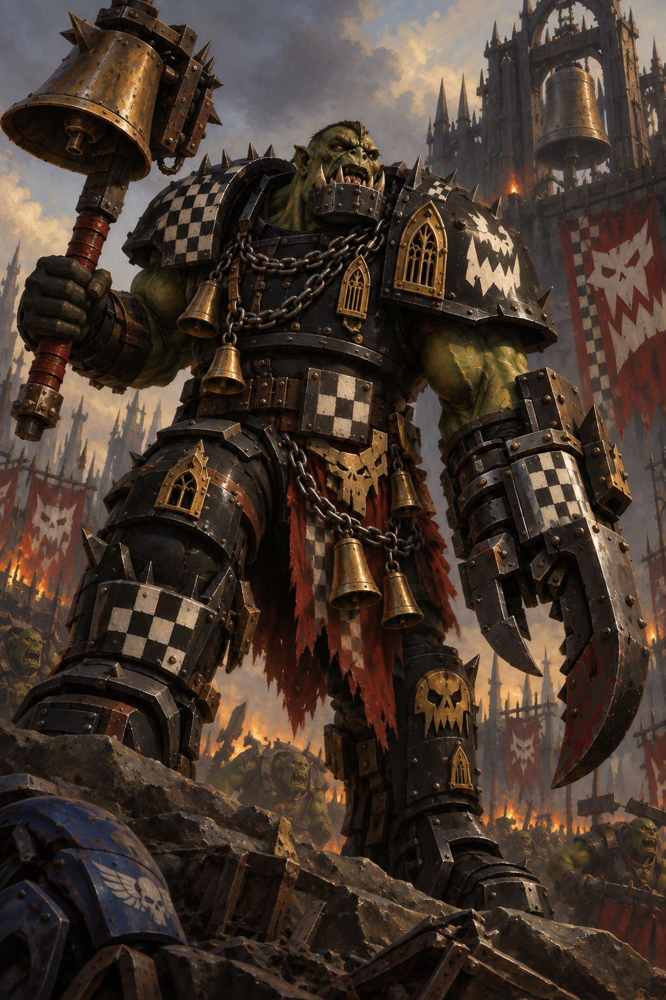

# The Atreus Campaign

Created 7 October 2026 · Subsector playtest · **Cycle 1 unopened**

Authoritative ledger: [Atreus_Campaign.md](https://noxanimusvicta.github.io/Soulstorm-Meta-Campaigns/Atreus_Campaign.md) · [Live campaign](https://noxanimusvicta.github.io/Soulstorm-Meta-Campaigns/atreus.html) · [Status](https://noxanimusvicta.github.io/Soulstorm-Meta-Campaigns/atreus-status.json)

Rules: **6 October 2026 playtest edition**, pinned to GitHub commit `113ec69a6163d36fb2164b9b624d14d8889986e5`. The complete pinned rules follow the campaign registers below. Later source changes do not automatically migrate this campaign. The observed balance spread remains 28 percentage points; human playtesting is now the purpose. Dessica remains a separate suspended campaign.

## Opening situation

For generations, Atreus sent armies outward and received their survivors through its shrines. Foundries cast engines beside cathedral bells; pilgrims crowded the same anchorages that loaded troop transports. Isolation has left the machinery of that old obligation intact in places, but no authority accepted everywhere.

From Tiryns, Warsmith Acastor Orontes offers the service of the Iron Paladins to worlds the wider Imperium can no longer reach. Canoness Althaia sees another danger in their arrival. To her, their ancestry and long passage through the Eye make their professions of loyalty impossible to trust. She intends to destroy the Chapter. In Calydon, Bell-Ringa has taken a foundry Capital and gathers mobs to the sound of stolen bells. The surviving rulers of Atreus must decide whose protection they can afford—and whose demands they can survive.

The Paladins’ loyalty is an established fact of the setting. Their supposed corruption is the Order’s conviction, not a revelation about the Chapter. No distant Imperial authority has issued a new decree in this campaign.

## Campaign conventions and opening status

- Three Major Factions, in fixed order: **Iron Paladins → WAAAGH! Bell-Ringa → Order of Saint Erigone**. Minor factions take no turns.
- Every Major starts with 20 Supply, 20 Manpower, one 5/5 fleet and its 12/12 Capital only. This equal 5/5 opening is the explicit Atreus setup convention; Create Fleet during play remains 1/5 unless a rule changes it.
- Each Major home system also contains one hostile ordinary Minor with a Standard and Minor planet. This is the approved home profile, not extra territory for the Major.
- Ten systems; Fleet Movement reaches any system with the normal action. **No directional, adjacency, distance or travel-lane mechanics.** The system directory is a roster, not a route network.
- Mycenae is the authored prize system: House Atreides owns a Capital planet, Standard planet and Minor station. This fixed profile implements the approved prize placement; it is not represented as a rolled ordinary profile.
- The remaining six systems use the saved d20 rolls. Ownership, names and faction identities are authored independently of those rolls. No rerolls were made.
- Campaign victory convention: the last surviving Major wins after rival Majors lose their final fallback. An agreed concession can end play earlier. Allied Minor holdings do not become owned territory and need not be conquered to meet this condition. No forced 100-Cycle ending.
- No opening event, income, recovery, action or battle has occurred. On opening, resolve Phase 0 once: construction effects, Logistics if due, then the event check. First Logistics is Cycle 3.
- Calendar date within Imperium Nihilus is intentionally unspecified. Track elapsed Cycles; there is no invented conversion to years. Exact officer ages and any finite lifespan windows remain unassigned, so no automatic ageing deaths are scheduled.
- Artwork establishes visual identity. Army Painter channel mapping remains unassigned until the actual faction interfaces are checked; this gives no mechanical benefit and does not delay campaign setup.

|Cycle|Phase|Event|Next faction|Pending battle|Next Logistics|
|---|---|---|---|---|---|
|1|Setup complete; awaiting opening Phase 0|Not rolled|Iron Paladins|None|3|

## Major faction registers

### 1. Iron Paladins

The Iron Paladins descend from loyal Iron Warriors who rejected Perturabo. Their penitence crusade in the Eye produced a distinct Chapter, its own offices and a religious obligation to the wounded Emperor. They serve the Imperium and would obey Guilliman; their independent operational oversight pending orders is not separatism. Orontes commands. Menandros advises, leads the Ironbound and is the designated successor; Jake retains the Warsmith’s decisions. The Chapter favours prepared assaults and durable protection, with each protected world adding obligations.

|Field|Starting value|
|---|---|
|Controller|Jake|
|Alignment|Imperium|
|Commander / deputy|Warsmith Acastor Orontes / First Paladin Menandros|
|Trait|The Iron Tithe — Efficient Logistics|
|Exact effect|Reinforce gives 8 Supply; Muster gives 8 Manpower. Total yield, one chosen Faction Action.|
|Capital|Tiryns — Argos — 12/12|
|Resources|20 Supply / 20 Manpower; neither deficit active|
|Fleet|Crusade Fleet Anabasis — Argos — 5/5; action unused|
|Constructions|Built-in Capital Orbital Shipyard only; no slot or Integrity project|
|Next Logistics if unchanged|4 Supply / 4 Manpower gross; 1/1 fleet upkeep; net +3 / +3|
|Briefing|[briefing_first_paladin_menandros.md](briefing_first_paladin_menandros.md)|

### 2. WAAAGH! Bell-Ringa

Bell-Ringa won his command by crushing his predecessor with a cathedral bell. The captured foundries of Da Bellworks support a Goff host that values hard fighting, working engines and trophies earned by conquest. Boss Nob Klanga coordinates mobs and detached forces. Growth depends on bringing fighters, ships and ammunition to the same battle; pride can draw the Warboss into an expensive unfinished fight. Da Gate-Krasha commemorates the fleet’s breaches of the foundry anchorage, without assigning a special ship or bonus.

|Field|Starting value|
|---|---|
|Controller|AI faction instance|
|Alignment|Ork|
|Commander / deputy|Warboss Bell-Ringa / Boss Nob Klanga|
|Trait|More Boyz Fer Da Fight — Martial Culture|
|Exact effect|+4 Manpower each Logistics Cycle.|
|Capital|Da Bellworks — Calydon — 12/12|
|Resources|20 Supply / 20 Manpower; neither deficit active|
|Fleet|Da Gate-Krasha — Calydon — 5/5; action unused|
|Constructions|Built-in Capital Orbital Shipyard only; no slot or Integrity project|
|Next Logistics if unchanged|4 Supply / 8 Manpower gross; 1/1 fleet upkeep; net +3 / +7|
|Briefing|[briefing_warboss_bell_ringa.md](briefing_warboss_bell_ringa.md)|

### 3. Order of Saint Erigone

The Order’s convents and shrine network preserve hospitals, military stores and authority across isolated communities. Its fictional campaign saint, Erigone, is remembered for three refusals of sanctuary to a rebel household. Althaia’s immediate case against the Paladins is their time in the Eye, reinforced by their Legion ancestry. She seeks their destruction and refuses joint operations regardless of their loyal conduct. Palatine Ianthe shares that judgement but can dispute methods and timing. Material support does not remove the need to conserve trained Sisters.

|Field|Starting value|
|---|---|
|Controller|AI faction instance|
|Alignment|Imperium|
|Commander / deputy|Canoness Althaia / Palatine Ianthe|
|Trait|The Consecrated Tithe — War Economy|
|Exact effect|+6 Supply each Logistics Cycle; no Manpower bonus.|
|Capital|Erigone — Eleusis — 12/12|
|Resources|20 Supply / 20 Manpower; neither deficit active|
|Fleet|The Third Refusal — Eleusis — 5/5; action unused|
|Constructions|Built-in Capital Orbital Shipyard only; no slot or Integrity project|
|Next Logistics if unchanged|10 Supply / 4 Manpower gross; 1/1 fleet upkeep; net +9 / +3|
|Briefing|[briefing_canoness_althaia.md](briefing_canoness_althaia.md)|

## Personnel and succession

|Faction|Commander|Deputy|Age / lifespan record|Succession|
|---|---|---|---|---|
|Iron Paladins|Acastor Orontes|Menandros|Astartes; biological ages unassigned. Orontes is a Heresy veteran; Warp time is not biological age.|Menandros designated; no event scheduled|
|WAAAGH! Bell-Ringa|Bell-Ringa|Klanga|Orks; exact ages unknown, no natural expiry imposed.|Klanga is deputy, not guaranteed a peaceful succession|
|Order of Saint Erigone|Althaia|Ianthe|Humans; exact ages and rejuvenation access unassigned. Source human range is guidance, not a death roll.|Ianthe operational deputy; formal succession requires recorded resolution|

One Manpower represents approximately 40 Astartes, 400 Orks or 100 Sisters in the relevant Major military pool. These are abstractions, not exact ship complements or fixed Chapter establishments. Succession does not reset resources or traits. Jake may temporarily voice Klanga or Ianthe as in-character counsel; neither receives an extra action.

## Diplomacy and explicit hostility exceptions

All three Majors are mutually hostile. **Iron Paladins ↔ Order of Saint Erigone** is an explicit same-Imperium exception: no alliance or joint operation during this campaign. This does not force every other Imperial faction to share Althaia’s accusation.

The **Argive Muster Council, Eleusinian Synod and House Atreides are hostile to both Imperial Majors** despite shared alignment: each rejects those Majors’ local authority. These are recorded political exceptions, not evidence of Chaos worship. Calydonian Labour Defence is hostile to the Orks and retains default Imperial alliance with the two Imperial Majors separately.

Aulis Anchorage Command, Delphic Custodians, Nemean Estate Compact, Lerna Reclamation Directorate, Ithacan Assembly and both Thessalian Commands retain default Imperial alliance with Imperial Majors. Allied does not mean subordinate: no shared stockpiles, automatic fleet orders or free cession. Allied participation needs consent and uses participating fleets’ actions. A Minor allied to both hostile Majors supplies neither side against the other unless its stance is explicitly resolved and recorded; do not count its fleet simultaneously as both friendly and hostile.

Rustjaw Mob shares default Ork alliance with Bell-Ringa but is a separate Minor, not an extra player-controlled fleet. Lotus Company is Independent and has no pact: hostile to all Majors. Different alignments are hostile by default. No communiqué, submission or negotiation has yet occurred.

## Fixed Third Party Raid

**The Nail-Takers**, an Iron Warriors raiding detachment led by **Warsmith Kordax**, are the fixed raiders for Atreus. Their name refers to the metal spikes driven through armour plates stripped from captured engines and displayed as trophies. They seek war matériel and captives while local defenders are committed elsewhere. They are separate from House Atreides and every other holding faction.

Use the **Iron Warriors** Soulstorm/Unification faction. The detachment has no campaign holdings, resource pool, fleet register, turns or territory-capture rights. The raid event is not active at setup. When it occurs, the raider fields one team in the first round, with each main side limited to three deployed teams while the raider remains; overflow waits in reserve. Once beaten, the raider is removed for that engagement. Subsequent main-side rounds use the agreed maximum four each and the survivor/reserve procedure. No extra trait or bespoke difficulty effect is granted.

## Systems and holdings

All holdings start at full defence; none is Defended. All fleets are unengaged with unused actions. A Capital’s built-in shipyard exists without a construction slot; other industrial or religious descriptions grant no completed construction.

### Argos

Former assembly and administration centre; the Chapter controls Tiryns, not the entire system.

Setup: fixed home/prize profile recorded above.

|Holding|Tier / type|Controller|Alignment|Defence|Logistics / infrastructure|
|---|---|---|---|---|---|
|Tiryns|Capital Planet|Iron Paladins|Imperium|12/12|4 Supply + 4 Manpower; built-in shipyard|
|Heraion|Standard Planet|Argive Muster Council|Imperium|4/4|2 Supply + 2 Manpower|
|Prosymna|Minor Planet|Argive Muster Council|Imperium|2/2|1 Supply + 1 Manpower|

|Fleet|Owner|Strength / original maximum|
|---|---|---|
|Crusade Fleet Anabasis|Iron Paladins|5/5|
|Ashields 1|Argive Muster Council|3/3|

Opening local balance: resident Major 5 versus hostile home Minor 3. The Major has Void Superiority; hostile fleet presence still prevents uncontested bombardment.

### Eleusis

Pilgrimage system divided between the Order and independent shrine authorities.

Setup: fixed home/prize profile recorded above.

|Holding|Tier / type|Controller|Alignment|Defence|Logistics / infrastructure|
|---|---|---|---|---|---|
|Erigone|Capital Planet|Order of Saint Erigone|Imperium|12/12|4 Supply + 4 Manpower; built-in shipyard|
|Triptolemos|Standard Planet|Eleusinian Synod|Imperium|4/4|2 Supply + 2 Manpower|
|Daeira|Minor Planet|Eleusinian Synod|Imperium|2/2|1 Supply + 1 Manpower|

|Fleet|Owner|Strength / original maximum|
|---|---|---|
|The Third Refusal|Order of Saint Erigone|5/5|
|Votive Watch 1|Eleusinian Synod|3/3|

Opening local balance: resident Major 5 versus hostile home Minor 3. The Major has Void Superiority; hostile fleet presence still prevents uncontested bombardment.

### Calydon

The Orks hold the principal foundry world; neighbouring human holdings remain unconquered.

Setup: fixed home/prize profile recorded above.

|Holding|Tier / type|Controller|Alignment|Defence|Logistics / infrastructure|
|---|---|---|---|---|---|
|Da Bellworks|Capital Planet|WAAAGH! Bell-Ringa|Ork|12/12|4 Supply + 4 Manpower; built-in shipyard|
|Pleuron|Standard Planet|Calydonian Labour Defence|Imperium|4/4|2 Supply + 2 Manpower|
|Olenos|Minor Planet|Calydonian Labour Defence|Imperium|2/2|1 Supply + 1 Manpower|

|Fleet|Owner|Strength / original maximum|
|---|---|---|
|Da Gate-Krasha|WAAAGH! Bell-Ringa|5/5|
|Foundry Guard 1|Calydonian Labour Defence|3/3|

Opening local balance: resident Major 5 versus hostile home Minor 3. The Major has Void Superiority; hostile fleet presence still prevents uncontested bombardment.

### Aulis

Embarkation yards, troop-marshalling settlements and stranded naval administration.

Setup: d20 **5**; ownership authored separately.

|Holding|Tier / type|Controller|Alignment|Defence|Logistics / infrastructure|
|---|---|---|---|---|---|
|Schoenus|Minor Planet|Aulis Anchorage Command|Imperium|2/2|1 Supply + 1 Manpower|
|Hyria|Major Planet|Aulis Anchorage Command|Imperium|8/8|3 Supply + 3 Manpower|

|Fleet|Owner|Strength / original maximum|
|---|---|---|
|Embarkation Guard 1|Aulis Anchorage Command|5/5|

There is no Major fleet here at setup. Void Superiority is calculated for the acting faction using the recorded diplomatic relationships; ownership alone does not grant it.

### Mycenae

The prize dynasty holds a fortified seat, military estates and an orbital anchorage.

Setup: fixed home/prize profile recorded above.

|Holding|Tier / type|Controller|Alignment|Defence|Logistics / infrastructure|
|---|---|---|---|---|---|
|Perseia|Capital Planet|House Atreides|Imperium|12/12|4 Supply + 4 Manpower; built-in shipyard|
|Dendra|Standard Planet|House Atreides|Imperium|4/4|2 Supply + 2 Manpower|
|Lion Gate|Minor Station|House Atreides|Imperium|2/2|1 Supply + 1 Manpower|

|Fleet|Owner|Strength / original maximum|
|---|---|---|
|Dynastic Squadron 1|House Atreides|5/5|
|Dynastic Squadron 2|House Atreides|5/5|
|Dynastic Squadron 3|House Atreides|5/5|
|Dynastic Squadron 4|House Atreides|3/3|

There is no Major fleet here at setup. Void Superiority is calculated for the acting faction using the recorded diplomatic relationships; ownership alone does not grant it.

### Delphi

Astropathic facilities, signal stations and archives whose messages no longer agree.

Setup: d20 **17**; ownership authored separately.

|Holding|Tier / type|Controller|Alignment|Defence|Logistics / infrastructure|
|---|---|---|---|---|---|
|Castalia|Minor Planet|Lotus Company|Independent|2/2|1 Supply + 1 Manpower|
|Corycia|Minor Planet|Delphic Custodians|Imperium|2/2|1 Supply + 1 Manpower|
|Pytho|Standard Planet|Delphic Custodians|Imperium|4/4|2 Supply + 2 Manpower|
|Omphalos Relay|Minor Station|Delphic Custodians|Imperium|2/2|1 Supply + 1 Manpower|

|Fleet|Owner|Strength / original maximum|
|---|---|---|
|Signal Guard 1|Delphic Custodians|4/4|
|Borrowed Warrant 1|Lotus Company|1/1|

There is no Major fleet here at setup. Void Superiority is calculated for the acting faction using the recorded diplomatic relationships; ownership alone does not grant it.

### Nemea

Agricultural estates and hunting preserves once bound to the crusade provisioning system.

Setup: d20 **13**; ownership authored separately.

|Holding|Tier / type|Controller|Alignment|Defence|Logistics / infrastructure|
|---|---|---|---|---|---|
|Cleonae|Minor Planet|Nemean Estate Compact|Imperium|2/2|1 Supply + 1 Manpower|
|Phlius|Minor Planet|Nemean Estate Compact|Imperium|2/2|1 Supply + 1 Manpower|
|Apesas|Major Planet|Nemean Estate Compact|Imperium|8/8|3 Supply + 3 Manpower|

|Fleet|Owner|Strength / original maximum|
|---|---|---|
|Harvest Watch 1|Nemean Estate Compact|5/5|
|Harvest Watch 2|Nemean Estate Compact|1/1|

There is no Major fleet here at setup. Void Superiority is calculated for the acting faction using the recorded diplomatic relationships; ownership alone does not grant it.

### Lerna

Wet industrial worlds and chemical works separated by contaminated waterways.

Setup: d20 **12**; ownership authored separately.

|Holding|Tier / type|Controller|Alignment|Defence|Logistics / infrastructure|
|---|---|---|---|---|---|
|Amymone|Standard Planet|Rustjaw Mob|Ork|4/4|2 Supply + 2 Manpower|
|Pontinos|Standard Planet|Lerna Reclamation Directorate|Imperium|4/4|2 Supply + 2 Manpower|
|Alcyonian Dock|Minor Station|Lerna Reclamation Directorate|Imperium|2/2|1 Supply + 1 Manpower|

|Fleet|Owner|Strength / original maximum|
|---|---|---|
|Sluice Patrol 1|Lerna Reclamation Directorate|3/3|
|Da Pipe-Bita 1|Rustjaw Mob|2/2|

There is no Major fleet here at setup. Void Superiority is calculated for the acting faction using the recorded diplomatic relationships; ownership alone does not grant it.

### Ithaca

Resettlement worlds of displaced families, veterans and descendants of missing crews.

Setup: d20 **17**; ownership authored separately.

|Holding|Tier / type|Controller|Alignment|Defence|Logistics / infrastructure|
|---|---|---|---|---|---|
|Neriton|Minor Planet|Ithacan Assembly|Imperium|2/2|1 Supply + 1 Manpower|
|Eumaia’s Rest|Minor Planet|Ithacan Assembly|Imperium|2/2|1 Supply + 1 Manpower|
|Same|Standard Planet|Ithacan Assembly|Imperium|4/4|2 Supply + 2 Manpower|
|Return Anchorage|Minor Station|Ithacan Assembly|Imperium|2/2|1 Supply + 1 Manpower|

|Fleet|Owner|Strength / original maximum|
|---|---|---|
|Homeward Watch 1|Ithacan Assembly|5/5|

There is no Major fleet here at setup. Void Superiority is calculated for the acting faction using the recorded diplomatic relationships; ownership alone does not grant it.

### Thessaly

Military estates, vehicle depots and open-country settlements divided between surviving commands.

Setup: d20 **16**; ownership authored separately.

|Holding|Tier / type|Controller|Alignment|Defence|Logistics / infrastructure|
|---|---|---|---|---|---|
|Pherae|Minor Planet|Thessalian Remount Command|Imperium|2/2|1 Supply + 1 Manpower|
|Pagasae|Minor Planet|Thessalian Remount Command|Imperium|2/2|1 Supply + 1 Manpower|
|Pelion|Minor Planet|Thessalian First Command|Imperium|2/2|1 Supply + 1 Manpower|
|Pharsalos|Standard Planet|Thessalian First Command|Imperium|4/4|2 Supply + 2 Manpower|

|Fleet|Owner|Strength / original maximum|
|---|---|---|
|First Commission 1|Thessalian First Command|3/3|
|Remount Escort 1|Thessalian Remount Command|2/2|

There is no Major fleet here at setup. Void Superiority is calculated for the acting faction using the recorded diplomatic relationships; ownership alone does not grant it.

## Minor faction register

Minor resources below are **derived defence values**, not spendable Major stockpiles. Ordinary fleet allocation is ceil(total maximum holding defence / 2); the prize uses the full sum. Partial final fleets keep their original setup maximum. No automatic rebuild follows a lost holding. No Minor has a faction trait.

|Minor|Leader / Alignment|Holdings|Fleet allocation|Derived Supply / Manpower|
|---|---|---|---|---|
|Argive Muster Council|Strategos Damas / Imperium|Heraion, Prosymna|3 total: 3|15 / 15|
|Eleusinian Synod|Prelate Lysandra / Imperium|Triptolemos, Daeira|3 total: 3|15 / 15|
|Calydonian Labour Defence|Marshal Oineus / Imperium|Pleuron, Olenos|3 total: 3|15 / 15|
|Aulis Anchorage Command|Commodore Thestor / Imperium|Schoenus, Hyria|5 total: 5|20 / 20|
|House Atreides (prize)|Archon Pleisthenes Atreides / Imperium|Perseia, Dendra, Lion Gate|18 total: 5, 5, 5, 3|70 / 70|
|Delphic Custodians|Logothete Manto / Imperium|Corycia, Pytho, Omphalos Relay|4 total: 4|20 / 20|
|Lotus Company|Captain Eurylochos / Independent|Castalia|1 total: 1|5 / 5|
|Nemean Estate Compact|Warden Adrastos / Imperium|Cleonae, Phlius, Apesas|6 total: 5, 1|25 / 25|
|Lerna Reclamation Directorate|Magister Polydoros / Imperium|Pontinos, Alcyonian Dock|3 total: 3|15 / 15|
|Rustjaw Mob|Boss Skrag Rustjaw / Ork|Amymone|2 total: 2|10 / 10|
|Ithacan Assembly|Speaker Eumaia / Imperium|Neriton, Eumaia’s Rest, Same, Return Anchorage|5 total: 5|25 / 25|
|Thessalian First Command|General Leontes / Imperium|Pelion, Pharsalos|3 total: 3|15 / 15|
|Thessalian Remount Command|Colonel Phereas / Imperium|Pherae, Pagasae|2 total: 2|10 / 10|

### Argive Muster Council

The surviving muster authorities dispute Orontes’ right to requisition their armies and stores. They remain Imperial in allegiance but refuse his local command.

### Eleusinian Synod

Independent shrine administrators and militia reject Althaia’s claim to absorb their hospitals and levies. Their dispute concerns jurisdiction, not devotion to Chaos.

### Calydonian Labour Defence

Human defence committees hold the settlements Bell-Ringa has not conquered. They welcome neither the Orks nor demands that would leave their people unprotected.

### Aulis Anchorage Command

Stranded naval officers preserve embarkation infrastructure under emergency orders. They will judge the Paladins by credentials and conduct; cooperation does not transfer ownership.

### House Atreides

The hereditary government claims a mandate to reunify Atreus. Its arsenal and fortified seat make it the prize Minor. It considers both incoming Imperial Major commanders to be exceeding their remit.

### Delphic Custodians

Archive officials and station security restrict access to surviving astropathic records. Contradictory messages support competing claims; no unearned intelligence bonus follows.

### Lotus Company

Human privateers occupy an outlying settlement and live by interception and salvage. Their contracts and warrants do not establish an Imperial alliance.

### Nemean Estate Compact

Landowners and militia defend the agricultural estates and hunting preserves that once provisioned crusades. They require credible protection before accepting new obligations.

### Lerna Reclamation Directorate

Reclamation crews and manufactorum security preserve chemical works and settled islands. Their infrastructure is mutually dependent, but their authority remains local.

### Rustjaw Mob

A separate Ork mob holds a captured industrial outpost. It shares Ork alignment with Bell-Ringa but has not submitted to his command or granted use of its forces.

### Ithacan Assembly

Settlement delegates and veterans govern displaced families. They value dependable protection over grand claims and may cooperate with the Paladins without endorsing their enemies’ accusations.

### Thessalian First Command

Officers of the senior surviving regimental headquarters claim authority over the vehicle depots and military estates.

### Thessalian Remount Command

A rival commission protects dispersed remount settlements. Its officers dispute the First Command’s seniority; neither is automatically subordinate to a Major.

## Minor force representation

All human Minor forces use Imperial Guard representation in Soulstorm: regulars, household troops, militia or naval landing parties according to their dossier. This is a declared proxy for their ground armies, not a change to Alignment. Rustjaw Mob uses Orks. Lotus Company uses Imperial Guard as human pirate troops while retaining Independent alignment. These choices add no traits or specialist construction bonuses. Exact unit rosters follow the battle setup, not the narrative titles.

## Construction register

No purchased, unfinished or upgraded projects at setup. Tiryns, Da Bellworks, Erigone and Perseia have only their inherent established-Capital shipyards. Minor Capital infrastructure does not grant the Minor a Faction Action or permission to build new fleets. The four yards have no construction Integrity track or slot cost and are destroyed on Capital fall under the source rules.

|Faction|Project|Type / location|Progress / Integrity|Effect / status|
|---|---|---|---|---|

## Setup provenance and decision ledger

The 6 October thematic roster, Major identities, Capitals, deputies and hostility concept were approved by Jake. The 7 October documentation task supplies the remaining authored setup: equal 5/5 starts, turn order, local holding names and ownership, the fixed Mycenae profile and Nail-Takers raider. These are declared setup choices, not historical campaign outcomes or random ownership results.

|System|d20 result|Reroll|
|---|---|---|
|Aulis|5|None|
|Delphi|17|None|
|Nemea|13|None|
|Lerna|12|None|
|Ithaca|17|None|
|Thessaly|16|None|

The saved machine-readable roll record is [Atreus_Setup_Rolls_2026-10-07.json](Atreus_Setup_Rolls_2026-10-07.json). No campaign event roll has been made. The system directory’s order does not encode movement restrictions. Planet/station type follows the roll; lore does not add holdings.

## Cycle ledger

| Cycle / phase | Orders | Costs | Outcome | Pending |
|---|---|---|---|---|
| 1 / unopened | None | None | Starting registers established | Open Phase 0, then request Iron Paladins orders |

## Cycle Records

No Cycle has been played. The opening situation is background, not a resolved-turn narrative.

## Pinned rules appendix

The following is the complete adopted 6 October edition. The explicit Atreus setup conventions above supply scenario-specific names, ownership, opening fleet strength, diplomacy and victory conditions. This is a frozen copy; later source-library edits require an agreed migration.

# Soulstorm campaign rules — current playtest edition

6 October 2026. This is the consolidated source for the selected decision/recovery package of 6 October, including its inherited rules and approved campaign conventions. It supersedes conflicting numerical rules in the 15 September baseline, 27 September draft and intermediate proposals. Do not combine their trait values with this edition.

This is a playtest release, not a claim of final balance. The latest 200-game comparison reduced the observed highest-to-lowest trait win-rate spread from 32 to 28 percentage points; it remains above the requested 25-point target. AI campaign results do not predict human Soulstorm win rates. Sector design, the global Soulstorm difficulty problem and the mod project remain deferred. Historical source, frozen studies and suspended Dessica Cycle 21 are unchanged.

For a new campaign, copy the templates, pin this edition and record local exceptions before play. The source is reusable; the campaign ledger alone records current resources, outcomes and characters. The reconciliation record is Source_Reconciliation_2026-10-06.txt.

## Setup, resources and personnel

New roster-building Subsector Major factions begin with 20 Supply and 20 Manpower, capped at 100 each. Both represent military resources, not the civilian economy. Use one agreed rules version and record exceptions before play. Major/Minor are campaign roles; Independent is an Alignment, never an automatic alliance. Fleets measure combat effectiveness, not a literal ship count.

Establish the Subsector's fixed raiding faction at setup; raiders cannot hold territory. Dessica's raiders remain Iron Warriors. Generate ordinary systems from the d20 table below: 2–4 combined planets/stations, averaging 3. Exceptional prize factions can hold Capitals.

### Faction Alignments

Factions sharing a non-Independent Alignment are allied by default; an explicit campaign hostility exception overrides that default. For example, the Atreus Sisters and Iron Paladins remain hostile despite both being Imperium-aligned. Record such exceptions before play. Otherwise, different Alignments are hostile unless an applicable diplomatic agreement says otherwise. Independent is an Alignment, not a faction size: two Independent-aligned factions are not automatically allied. They need an explicit pact or recorded subordinate relationship. Major/Minor describes campaign role separately from Alignment.

| Faction | Alignment | Per Manpower | Ratio to Marine | vs Guard | Force Description |
|---------|-----------|--------------|-----------------|----------|-------------------|
| Space Marines | Imperium | 40 | 1:1 | 1:15 | Battle-brothers only. Chapter Serfs, Servitors, and non-combat personnel not tracked. Vehicle crews included. |
| Chaos Space Marines | Chaos | 40 | 1:1 | 1:15 | Traitor Astartes only. Cultists, mutants, and daemonic auxiliaries supplement forces but not explicitly tracked. |
| Grey Knights | Imperium | 40 | 1:1 | 1:15 | Battle-brothers only. Inquisitorial retinues and support staff not tracked. |
| Sisters of Battle | Imperium | 100 | 1:2.5 | 1:6 | Battle Sisters and vehicle crews. Ecclesiarchy support, Arco-flagellants, Penitent Engines as auxiliary not tracked. |
| Imperial Guard | Imperium | 600 | 1:15 | Baseline | Frontline infantry, officers, heavy weapons teams, tank crews. Logistics and rear echelon not tracked. |
| Traitor Guard | Chaos | 600 | 1:15 | Baseline | As Imperial Guard. Mutants and Chaos-touched may supplement but not tracked. |
| Craftworld Eldar | Aeldari | 100 | 1:2.5 | 1:6 | Mix of Aspect Warriors and Guardian militia. Seers, vehicle crews included. Wraithbone constructs as heavy support not explicitly tracked. |
| Harlequins | Aeldari | 15 | 2.67:1 | 1:40 | Players only. Troupes, Shadowseers, Death Jesters, Solitaires. No auxiliaries - they operate alone. |
| Drukhari | Drukhari | 160 | 1:4 | 1:3.75 | Kabalite Warriors, Wyches, vehicle crews. Haemonculus creations and slaves may supplement raids but not tracked. |
| Necrons | Necron | 160 | 1:4 | 1:3.75 | Warriors, Immortals, command elements. Canoptek constructs (Scarabs, Wraiths, Spyders) as auxiliary not explicitly tracked. |
| Tau | T'au | 320 | 1:8 | 1:1.9 | Fire Caste Warriors, Pathfinders, Battlesuit pilots, vehicle crews. Kroot and Vespid auxiliaries handled as separate formations. |
| Orks | Ork | 400 | 1:10 | 1:1.5 | Boyz, Nobz, specialist mobs, vehicle crews. Gretchin serve as support. Squigs not tracked. |
| Tyranids | Tyranid | 800 | 1:20 | 1:1.3 | Weighted average: primarily Gaunts with Warriors and Genestealers as synapse/elite. Larger bioforms (Carnifexes, etc.) as heavy support. |
| Chaos Daemons | Chaos | 100 | 1:2.5 | 1:6 | Full daemonic incursion: lesser daemons as line troops (Bloodletters, Daemonettes, Plaguebearers, Horrors). Greater Daemons and Daemon Princes as command elements. |
| Adeptus Mechanicus | Imperium | 240 | 1:6 | 1:2.5 | Skitarii Rangers/Vanguard, Tech-Priests, Servitors. Battle Automata and heavier war machines as support not explicitly tracked. |
| Independent (Rogue Traders, Pirates, minor xenos, unaligned forces) | Independent | Varies | Varies | Varies | Independents are all-encompassing. Manpower ratios depend on the specific force composition — use the ratio of whichever faction type best represents the force being fought. |

---

### Personnel lifespan reference — 20 September 2026

Place this reference alongside the Manpower conversion table. These describe personnel, not the age of a faction or its entire Manpower pool. Numeric campaign defaults below are provisional house assumptions, not universal canonical death ages. Track biological age separately from time spent in stasis or distorted Warp time. No Cycle-to-years conversion is introduced here.

| Personnel profile | Lifespan guidance for campaign records |
|---|---|
| Unaugmented humans: Guard, Sisters, mortal Traitor Guard, human Independents | Proposed natural-age reference: 60–100 Terran years where living conditions and medical care permit. This is a house range, not average Imperial life expectancy or a mandatory retirement age. |
| Humans with sustained rejuvenation | Centuries are possible; proposed record range 200–400 years, adjusted for the specific treatment and character. Not automatically available to all human personnel. |
| Space Marines and Grey Knights | Centuries; exceptional individuals exceed a millennium. No established universal natural death age: record individual history rather than imposing a fabricated species expiry. |
| Chaos Space Marines | Astartes baseline, modified by recorded Warp exposure and supernatural effects. Calendar age is not automatically biological age. |
| Craftworld Aeldari and Harlequins | Millennial lifespans; approximately 1,000–2,000+ years as broad reference, not a hard maximum. Individual and psychic exceptions apply. |
| Drukhari | Record Aeldari ancestry plus rejuvenation/reconstruction arrangements; no automatic old-age deadline while sustained by those arrangements. |
| T'au | Approximately 40 Terran years ordinarily. Record stasis, exceptional medicine or other established life extension separately. |
| Orks | No dependable natural maximum specified here; do not invent an automatic old-age death. |
| Necrons | No ordinary biological ageing; destruction, degradation and personality loss are distinct narrative events. |
| Tyranids | Bioform-specific lifespan and recycling; persistent command identity is not necessarily the same biological body. No species-wide age band. |
| Chaos Daemons | No ordinary biological lifespan; banishment and destruction follow their narrative circumstances. |
| Adeptus Mechanicus | Human baseline modified individually by augmentation and rejuvenation; heavily augmented personnel may endure for centuries or longer. |
| Independent or mixed-species personnel | Use the actual individual's species and recorded life extension; Independent is not a species. |

Reference sources for numerical anchors: [human rejuvenation](https://wh40k.lexicanum.com/mediawiki/index.php?title=Rejuvenat), [T'au physiology](https://wh40k.lexicanum.com/mediawiki/index.php?title=T%27au), and [Aeldari](https://wh40k.lexicanum.com/wiki/Aeldari). These are lore reference summaries; proposed human ranges are campaign conventions. Major factions select narrative succession; the referee manages Minor personnel. Succession retains the faction trait. Agree any finite character death window when establishing that character, rather than retroactively assigning one.

## Faction traits

Narrative names do not change the following mechanics. Each faction uses one profile. Income and refunds respect the resource cap and deficit locks.

| Trait | Current effect |
|---|---|
| Mobile Capital | Starts with a 12/12 Mobile Capital instead of an ordinary starting fleet. Grants 4 Supply and 4 Manpower each Logistics Cycle, a built-in shipyard and support for planetary constructions. No Mobile Capital upkeep. Its intrinsic hull contributes floor((6 × current hull + 5) / 10) combat Strength: 7 at 12 hull. Added permanent Fleet-construction Strength contributes in full and takes damage before intrinsic hull. Losing the Mobile Capital permanently removes the trait. |
| War Economy | +6 Supply each Logistics Cycle. |
| Martial Culture | +4 Manpower each Logistics Cycle. |
| Efficient Logistics | Reinforce grants 8 Supply; Muster grants 8 Manpower, instead of the normal 3. These are total action yields. |
| Salvagers | +3 Supply on a qualifying victory; +1 on defeat or draw; +1 additional Supply on capture. Ground battles, Fleet Battles and guarded Structure Assaults qualify, once per participating faction per engagement. Uncontested bombardment and unguarded Structure Assaults do not. If raiders win, both main factions receive the defeat reward. |
| Void Supremacy | Ordinary Expand Fleet restores up to 4 Strength for 1 Supply and 1 Manpower, without a shipyard. Ordinary fleet upkeep is 0 Supply and ceil(number of living ordinary fleets / 2) Manpower. Creation still needs a yard; this does not improve Mobile Capital self-repair. |
| Swift Mobilization | Create Fleet produces 6/6 for 1 Supply and 1 Manpower. Its base capacity remains 6; existing starting fleets are not enlarged retroactively. The new fleet cannot act that Cycle. Ordinary fleet upkeep is ceil(number of living ordinary fleets / 2) of each resource. Expand remains the normal +2. |
| Fleet Endurance | Each Cycle, before events, restore up to 2 Strength to every surviving fleet, capped at its actual maximum. Ordinary fleet upkeep is ceil(number of living ordinary fleets / 2) of each resource. No resurrection or Integrity repair. |
| Siege Doctrine | Ground Assault base Supply cost is ceil(holding tier / 2); enemy surcharges are not halved. Ignore Defended. Victory adds 1 damage above the ordinary +1 breakthrough; defeat deals 1 before mitigation. On victory, recover 2 additional committed Manpower, capped at commitment, and refund 1 paid base Supply. No refund funds the attack in advance; no surcharge refund or non-victory refund. |
| Dread Reputation | Each attack against this faction costs the initiator an additional 2 + max(1, ceil(declared participating combat Strength / 5)) of BOTH Supply and Manpower. Calculate before initiation losses or cannons, including ground-only Strength for a Ground Assault. Charge once for the combined group, including allied assets. Applies to ground, naval, bombardment and targeted construction attacks. This Manpower is expenditure, not recoverable commitment. No Soulstorm difficulty modifier. |
| Fortification Experts | The holding/Mobile Capital Defend action costs no resources, restores up to 4 defence, grants Defended and grants 2 Supply. It still uses the Faction Action, including when defending a full holding. No Manpower grant, Integrity repair or construction discount. |
| Industrial Efficiency | Each Build or Upgrade action costs 3 less Supply, minimum 1. A new project begins at 2 Integrity; subsequent Build and Upgrade actions add the normal 1. Repair is unchanged. |

## Cycle sequence and resources

**Phase 0 happens once globally (there is no separate second event phase):** snapshot and resolve periodic construction damage; apply surviving eligible repair/regeneration effects; resolve Logistics on Cycles 3, 6, 9…; then make the single event check. Endurance recovery precedes events. No faction gets a second copy on its own turn. Destruction precedes repair, and destroyed assets cannot regenerate.

Logistics grants Supply and Manpower equal to owned holding tiers: Minor 1, Standard 2, Major 3, Capital 4, plus active constructions and traits. Ordinary living fleets normally cost 1 of each resource per Logistics Cycle; apply the trait upkeep exceptions above. Credit income up to the 100 cap first, then deduct upkeep; income above the cap is not banked against upkeep. Mobile Capitals do not pay ordinary fleet upkeep. Existing deficit locks suppress their affected resource's income and penalties.

Each Major then completes Phase 2 Fleet actions, one Phase 3 Faction action, one Phase 4 Social action and one Phase 5 Construction action in that order. Resolve each attack before dependent later actions. A player battle pauses the turn for the reported result; do not update GitHub with unresolved projected outcomes. At Cycle end resolve eligible Minor recovery and record the narrative, then advance the Cycle and begin the next Phase 0. Defended expires at the start of the owning faction's next turn. Attacked/engaged flags govern the relevant recovery interval and are cleared only after that recovery has been assessed. Narration uses in-world language; mechanical records remain separate.

**Voluntary expenditure must leave each resource spent above 0.** Involuntary losses may trigger deficits. Automatic defensive commitment is calculated for the battle but the final actual loss is settled once, after the attack on the attacker's turn. Planet Fall replaces ordinary defeat Supply loss rather than adding it twice. It is not the voluntary Defend action.

## Fleet and Faction actions

- Every fleet has one offensive/movement Fleet Action per Cycle, including consented participation on an ally's turn. Defending is automatic and consumes no action, even after an earlier action.
- Move to any system in the Subsector: map directions describe location, not adjacency or extra travel distance. Storms prevent ordinary movement. Only an explicit ability such as Scout combines movement and attack.
- Expand at an available yard: 1 Supply and 1 Manpower for+2 strength, capped at actual maximum, subject to trait exceptions.
- Create Fleet uses the Faction Action at an available yard: 1 Supply and 1 Manpower, normally 1/5. Yard/trait starting strengths use the best applicable value, not an additive stack. The new fleet takes no Fleet Action that Cycle.
- Reinforce gives 3 Supply; Muster gives 3 Manpower; Efficient Logistics gives 8. Rationing replaces the relevant action while its resource is locked.
- Defend a holding or Mobile Capital costs its tier in each resource, restores that much defence, and grants Defended until the next turn. Fortification uses its listed exception. Full-defence hosts can receive Defended without extra restoration.
- Fleet Transfer/Merge require co-location and Void Superiority; only the initiator spends an action. A Transfer donor retains at least 1; transfer amounts respect actual capacity. A Merge absorbs the other fleet completely without a fleet-destruction penalty. Its constructions transfer, including permanent capacity. Keep the absorbing fleet's base capacity and add the absorbed fleet's permanent construction capacity, not its ordinary base capacity. Excess combined current Strength above that surviving capacity is lost. Mobile Capitals cannot be transferred or merged.
- Garrison Transfer may distribute defence within a system. Donors normally start full and always retain 1; recipients cannot exceed maximum. An active Landing Zones recipient permits damaged donors. This uses the Faction Action.
- Scuttle a fleet with Void Superiority, using its Fleet Action, to recover floor(current Strength / 2) Supply. Apply destruction penalties before the refund; it cannot fund an otherwise illegal voluntary action. A Mobile Capital also incurs its Capital penalties and permanently loses its trait. Scuttling cannot cause a resource deficit.

### Holdings, Void Superiority and action timing

| Holding tier | Normal defence | Logistics income (each resource) | Ground Assault base Supply | Normal Defend cost (each resource) and restoration |
|---|---:|---:|---:|---:|
| Minor | 2 | 1 | 1 | 1 |
| Standard | 4 | 2 | 2 | 2 |
| Major | 8 | 3 | 3 | 3 |
| Capital | 12 | 4 | 4 | 4 |

Planets and stations use the same tier rules. Void Superiority means the total friendly combat Strength in a system strictly exceeds total hostile combat Strength; a tie is contested. Include allied fleets and Mobile Capitals. This is different from uncontested bombardment, which requires no hostile fleet at all. A full holding may still take Defend to gain Defended. Ordinary Defend restores the tier amount, capped at maximum; Fortification replaces that amount with 4. Active Militia Barracks removes the holding Defend action's Manpower cost, not its normal Supply cost.

A Mobile Capital may spend its Fleet Action and 1 Supply / 1 Manpower to Expand itself by up to 2 defence. This does not grant Defended or repair attached Integrity. Its Faction-action Defend normally costs 4 of each resource and restores up to 4. Its actual defence, not its reduced combat contribution, determines whether its construction host is full.

Establish New Capital is compulsory when applicable. An established Capital's built-in Orbital Shipyard costs no construction action, Supply or slot. Normal fleets have base capacity 5 unless a rule explicitly changes it. Repair and expansion use actual capacity, including permanent additions.

### Summon Allies

Call a new allied Major Faction into the subsector by granting them an entire system. **Costs -10 Supply and -10 Manpower.** The newly summoned faction starts with 10 Supply and 10 Manpower (inherited mid-campaign Summon Allies exception to the 20/20 opening start) but no fleet — they rely on their summoner for protection. **Requirements:** (1) You must control planets in more than one system. (2) You must control ALL planets in the system being granted. (3) You must have Void Superiority in that system. (4) The new faction must share your alignment and make sense within established 40K lore. **Effect:** Immediately cede all planets in that system to the new faction. The new faction is aligned with you — they will not attack your holdings and will coordinate against mutual enemies. Design the new faction (name, background, trait) when summoned. The new faction activates immediately after your turn in the turn order.

**Important:** You cannot grant away your only fully controlled system. You must fully control at least two systems to use Summon Allies — one to keep and one to grant.

**Summon Allies — Alignment Restrictions:**

The summoned faction must belong to the same broad alignment as the summoning faction. This represents calling in reinforcements, granting territory to allies, or allowing subordinate powers to establish their own domains. The new faction must have a plausible lore reason for arriving in the subsector.

| Alignment | Eligible Faction Types | Examples |
|-----------|----------------------|----------|
| Imperium | Astra Militarum, Adeptus Mechanicus, Other Space Marine Chapters, Adepta Sororitas, Rogue Traders, Imperial Navy, Inquisitorial Forces | A cut-off Guard regiment, an Explorator fleet, a Magos establishing a Forge World, a brother Chapter answering a distress call |
| Chaos | Other Chaos Warbands, Daemon Cults, Dark Mechanicum, Traitor Guard, Other Traitor Legions | A warband sworn to a different god, a cult that rises in the new territory, a splinter fleet of the same Legion |
| Drukhari | Other Kabals, Wych Cults, Haemonculus Covens | A rival Archon granted hunting grounds, a Coven providing support in exchange for specimens, a Wych Cult seeking new arenas |
| Craftworld Aeldari | Other Craftworlds, Corsairs, Harlequins, Ynnari | A Corsair fleet, rangers from another Craftworld, a Harlequin masque |
| Orks | Other Warbosses, Freebooterz | Another Waaagh! drawn by the fighting, Freebooterz smelling loot |
| Necrons | Other Dynasties, Destroyer Cults | An awakening Tomb World, a vassal Dynasty, a Destroyer Lord claiming territory |
| Tyranids | Other Hive Fleets, Genestealer Cults | A splinter fleet, a cult uprising on the granted world |
| T'au | Other Septs, Auxiliaries | An expansion fleet, Kroot kindreds, Vespid contingents |

**Summoned capital — ruling, 16 September 2026:** The new faction chooses an existing planet or station in the ceded system as its provisional capital and performs Establish New Capital normally. Summoning grants no free defence increase or built-in shipyard; the shipyard becomes available only when establishment is complete. The faction still starts with 10 Supply, 10 Manpower and no fleet, and takes its first turn immediately after its summoner.

**Independent summoners:** Record an explicit subordinate pact when an Independent-aligned faction summons an ally. Shared Independent Alignment alone never allies unrelated factions. Sector-level grant and roster consequences remain undefined.

**Multiple Factions:** You may have multiple factions of the same type in play (e.g., two Space Marine Chapters, three Drukhari Archons). Each operates independently but remains aligned with their summoner.

### Phase 4: Social Action

A faction may take ONE Social Action per turn. This represents diplomatic bandwidth.

| Action | Effect |
|--------|--------|
| **Communiqué** | Send one message to another Faction. They may respond immediately but only once. Requires both Factions to have a presence in the same system (fleet or planet — any combination). Extended conversations require multiple cycles. |

#### Diplomacy with Non-Aligned Factions

**Diplomacy with Non-Aligned Factions:** Temporary cease-fires or non-aggression pacts with factions outside your alignment are possible through the Communiqué action, but these are inherently unstable. Conflicting alignments will inevitably come to blows — such arrangements should be treated as temporary strategic convenience, not true alliance.

## Combat and capture

**Ground Assault:** available even with hostile fleets present. Only committed fleets contribute. Apply Orbital Cannons to the largest attacker before strength and Manpower commitment. A legal assault needs at least 5 ground Strength after projected cannon damage. Commit floor(participating ground Strength / 5) Manpower. Pay world-tier Supply, or Siege's reduced cost, plus any Dread surcharge. Check affordability for the whole expenditure, not each component in isolation. Ground Strength includes Carrier/Assault Boats; flat Bay/Platform damage does not increase attacker commitment. There is no naval initiation loss for a Ground Assault.

A Mobile Capital can be targeted by Ground Assault like a Capital, but is destroyed at zero rather than captured. It cannot be uncontested-bombarded while alive. Orbital Cannons also fire against bombardment; Dread is assessed before cannons, while ordinary attack Strength and costs use the surviving group. Attached projects lose Integrity only for actual host damage, capped at the host's remaining defence, not overkill.

If cannons destroy the entire attacking group on approach, cancel the assault before ordinary Supply and Manpower commitment; spent actions and the earlier Dread charge remain spent. No ground battle or capture occurs. This failed approach is not an exception allowing a surviving group below 5 ground Strength to launch a ground battle.

Successful damage = floor(ground strength/5)+1, plus applicable trait/construction damage, after mitigation. Ordinary defeat causes no ground damage; Siege causes 1. Capture at 0 resets the holding to 1 defence. The attacker normally recovers floor(60% committed Manpower) on victory. Best participating Troop Transport adds 2 returned Manpower, 4 upgraded, capped at commitment; transports do not stack. This is the accepted replacement for historical 70%/80% transport wording.

For the attacking side use committed ground Strength; for the defending side use eligible in-system defending fleets' combat Strength, not the holding's defence and not ground-only Carrier/Assault Boats bonuses. AI ground totals use d20 + the applicable side's strength + floor(Supply/5) + floor(Manpower/5), using post-commitment resources. Defended gives defender+4 unless Siege; Ambush+4 to defender; Intel+4 to attacker; Bunker+4/+8; Isolated Defence−8. Ties favour the defender. AI defenders commit floor(incoming damage/2) Manpower and normal tier Supply limited to available stock; winning defenders recover 60% committed Manpower and 80% committed Supply, rounded down. In a human-resolved engagement, defensive commitment is full incoming potential damage and winning defensive Manpower recovery is 80%. Incoming potential damage includes breakthrough and flat damage bonuses before mitigation, not just points actually removed from the host. Militia removes defensive commitment/isolation. Forced Conscription draws the required defence from other fully defended owned donor holdings, leaving at least 1 each; these need not be in the attacked system. It substitutes for the commitment, not for resources in a deficit pool. Without affordable commitment or adequate conscription, the defence is Isolated. A losing attacker against an Isolated defence retains the inherited exception: floor(60% commitment) plus 1/2 for the best base/upgraded Transport, capped at commitment; no Siege victory bonus and no such recovery if raiders win.

**Uncontested Bombardment:** no hostile fleet presence, 0 ordinary Manpower (Dread still charges both resources), damage max(1, floor(participating combat Strength/5)); Supply cost 2×tier+that damage, plus Dread. Mitigation applies and defence cannot fall below 1. No capture or battle roll. A surviving Mobile Capital is itself defending fleet presence and prevents uncontested bombardment.

**Fleet Battle:** one initiation Strength point from one participating asset with more than 1 Strength. This expenditure does not damage attached constructions. Escort adds 3/6 to its side; defending system Defence Platforms add 5/10. Each side rolls 2d6 plus applicable strength/modifiers; a positive margin inflicts ceil(margin/3) damage on every participating losing fleet, without a damage cap. Ties inflict no combat damage; costs/actions remain spent. Destruction and attached construction damage apply normally. There is one Fleet Battle per initiating faction/system/turn; a guarded Structure Assault uses that allowance.

**Structure Assault:** target one construction. If guarded, use Fleet Battle resolution, but an attacking win damages the construction only; attacker defeat damages participating attackers normally. An unguarded target costs 2 Supply plus Dread, no ordinary Manpower commitment, and suffers max(1, floor(combat Strength/5)) Integrity damage. There is no general Integrity floor. Completed permanent Assault Cruiser/Flagship capacity is the explicit exception: its granted portion remains until the fleet dies; unfinished upgrade progress can still be damaged. Movement/attack/withdrawal require separate actions unless an ability combines them.

**Planet Fall:** captured non-Capital holdings impose 2 Supply/2 Manpower; Capitals 4/4. Replace ordinary defensive Supply loss, and add the applicable defensive Manpower loss. Fleet damage equals the final assault's resolved damage, including overkill beyond the holding's remaining defence. Apply it to the defeated owner's eligible fleets in that system. Allocate it point by point to the currently strongest eligible fleet, logging seeded/random tie choices automatically. Do not stop for a separate player allocation message. Destroy fleets with no remaining planet, station or Mobile Capital fallback. Minor factions do not lose Major resource pools. Destruction of a Major faction's fleet, including a Mobile Capital, also costs 1 Manpower; apply existing deficit locks normally.

## Capital replacement and deficits

Every owned planet or station can become the replacement Capital when the functioning Capital is lost. Establish New Capital is free, takes priority over rationing and doubles current/maximum defence toward 12. Completion requires actual 12/12; only then grant Capital tier/income and the built-in yard. Being attacked may delay completion. No holding or surviving Mobile Capital means elimination, not an endless Capital-recovery loop. A destroyed Mobile Capital permanently loses its trait and incurs 4 Supply / 4 Manpower loss plus the fleet-destruction 1 Manpower. It does not apply ordinary Planet Fall collateral damage to other fleets. Owned planets or stations still allow replacement Capital establishment. Lock the chosen provisional holding until it is lost; establishment doubles current and maximum defence, each capped at 12, without granting Capital income or the yard early.

Each resource has its own deficit track. Involuntary depletion to 0 locks that resource at 0, ignoring its income and further resource penalties while the other resource behaves normally. Entry removes 1 Strength from each surviving fleet once for that resource: Supply can destroy fleets; Manpower degradation leaves surviving fleets at least 1. Resolve simultaneous Supply first. Direct combat/construction damage remains effective.

Emergency Rationing takes a chosen Faction Action: three actions on a track restore exactly 10 total. Overlapping tracks require separate actions and the faction chooses which to advance; elapsed Cycles do not advance them. Other affordable actions remain available subject to Capital replacement priority, and ordinary Reinforce/Muster cannot bypass the corresponding deficit. Ignore income lost during the lock rather than banking it.

## Minor factions and systems

Ordinary Minor starting Fleet Strength = ceil(sum of maximum defence of owned holdings in the system/2), distributed into fleets up to 5. Prize factions use the unhalved sum. Maximum defence determines the initial fleet allocation; losing a holding does not rebuild the allocation. Apply normal Planet Fall fleet losses.

Each Minor's Supply and Manpower are separately 5 × sum(owned holding tiers), doubled for prize factions. These are shared derived values, not per-planet pools or persistent Major stockpiles. Defence damage alone does not reduce them. Minors take no turns, cannot build replacements, and lose no Major-style resource penalties. At Cycle end, each unattacked Minor holding recovers 1 defence, capped at maximum. An unengaged Minor faction restores 1 total Strength to an eligible surviving damaged fleet. Major holdings have no free ordinary recovery; they need Defend or an applicable construction.

## Construction costs, Integrity and capacity

One Construction action begins/advances one project or repairs a completed construction. Minor stages normally cost 3 Supply, Major stages 5, with the catalogue exceptions below. Grand Orbital Shipyard is now Minor (3 stages). Troop Transport, Repair Tender, Militia Barracks and Void Shield Generator cost 2 Supply per stage. System Defence Station, System Repair Station, Salvage Wing, Storm Transit, Consolidation Works and Void Station cost 3 per stage. Minor base/upgrade each require 3 stages; Major each 5. Industrial costs and starting Integrity apply as listed. Full host defence/strength is required to Build, Upgrade or Repair; system-based constructions require an owned holding or living fleet providing presence in their system, but have no host defence prerequisite.

Repair restores up to 3 Integrity at 1 Supply each, no Manpower. It cannot finish unfinished construction/upgrades. A separate Faction-action Defend may repair a completed damaged construction at a full host: Minor costs 1 Supply / 1 Manpower and restores 1 Integrity; Major costs 3 of each and restores 3. Fortification Experts does not alter this construction action. Repair never completes unfinished Build/Upgrade work.

Every point of actual host damage removes 1 Integrity from every attached project. Initiation/resource expenditure is not damage. At 0, construction is destroyed regardless of source. Minor 3/Major 5, upgraded 6/10 maximum Integrity. Ordinary planetary/system constructions operate at full applicable Integrity; an upgrade retains its completed base effect while Integrity remains at least the base maximum. Newly unfinished projects give no effect.

**Persistent planetary exceptions:** once completed, Automated Defences, Regenerative Fortifications, Landing Zones, Militia Barracks, Void Shield Generator and Fortification Network retain their base effect at positive Integrity. Full upgraded Integrity is required for improved effects, except already granted Fortification Network capacity persists until destruction. Its completion adds 2 current and maximum defence, or 4 total after upgrade; repair never grants that capacity again. At destruction remove the granted maximum and cap current defence accordingly.

Completed **Fleet-category** constructions retain base effects at any positive Integrity; upgraded effects require full upgraded Integrity. Their base remains during upgrading. This category exception does not turn a planetary Forge aboard a Mobile Capital into a Fleet construction, or protect an unfinished Void Station as one. Completed Assault Cruiser/Flagship capacity remains until the fleet is destroyed. Repair never grants unrelated lost Fleet Strength.

One ordinary construction slot per holding, with its established Capital's built-in yard free and outside the slot. Consolidation is a holding development, not a permanent occupied building slot. Apply the existing shipyard/Grand Yard prerequisite chain. No new fleet/system construction cap; normal unique-profile rules and transferred fleet constructions remain. Multiple projects may exist but only one Construction action is available.

Capture applies host/construction damage first. Surviving planetary constructions transfer with remaining Integrity/progress. System constructions transfer only when one faction controls all planets and has Void Superiority: Minor transfers, Major destroyed. Completed Void Stations are holdings and use ordinary capture; an unfinished station remains attached to its construction fleet.

### Construction catalogue

Costs below are per action, not total project prices. Action counts assume undamaged progress and normal starting Integrity; Industrial starts new projects at 2. An upgrade adds another base-sized block to maximum Integrity and normally takes the same number of Build actions as the base. “No upgrade” means no separate upgraded profile. A destroyed project must be rebuilt.

**Planetary/Orbital Constructions** — Built on a specific planet, station or eligible Mobile Capital. Affects that planet or system.

*Minor (3 actions base, 3 actions upgrade, capturable)*

| Construction | Supply per Build/Upgrade action: normal / Industrial | Base Effect | Upgraded Effect |
|---|---:|---|---|
| [Orbital Shipyard] | 3 / 1 | Allows fleet creation and ordinary expansion here; Create normally starts 1/5 | No upgrade; prerequisite for Grand Orbital Shipyard |
| [Grand Orbital Shipyard] | 3 / 1 | Minor, 3 stages: Create at 3/5; requires a shipyard, including a built-in Capital yard | Create at 5/5; best starting-Strength effect applies, not an additive stack |
| [Supply Depot] | 3 / 1 | +3 Supply per Logistics Cycle | +6 Supply per Logistics Cycle |
| [Training Grounds] | 3 / 1 | +3 Manpower per Logistics Cycle | +6 Manpower per Logistics Cycle |
| [Automated Defences] | 3 / 1 | +1 defence regen/cycle if not attacked | +2 defence regen/cycle if not attacked |
| [Bunker Network] | 3 / 1 | +4 defender roll (AI) / -1 Difficulty (Player) | +8 defender roll (AI) / -2 Difficulty (Player) |
| [Landing Zones] | 3 / 1 | Minor: Garrison Transfers to this holding may use damaged donors; donors retain 1. | No upgrade |
| [Orbital Cannons] | 3 / 1 | -1 Fleet Strength to largest hostile fleet when attacked | -2 Fleet Strength to largest hostile fleet when attacked |

*Major (5 actions base, 5 actions upgrade; surviving planetary constructions transfer on capture)*

| Construction | Supply per Build/Upgrade action: normal / Industrial | Base Effect | Upgraded Effect |
|---|---:|---|---|
| [Forge Complex] | 5 / 2 | +7 Supply per Logistics Cycle | +14 Supply per Logistics Cycle |
| [Military Academy] | 5 / 2 | +7 Manpower per Logistics Cycle | +14 Manpower per Logistics Cycle |
| [Regenerative Fortifications] | 5 / 2 | +3 defence regen/cycle if not attacked | +6 defence regen/cycle if not attacked |
| [Void Shield Generator] | 2 / 1 | -1 incoming attack damage (can reduce to 0) | -2 incoming attack damage (can reduce to 0) |
| [Fortification Network] | 5 / 2 | +2 to planet's maximum defence | +4 to planet's maximum defence |
| [Militia Barracks] | 2 / 1 | No defensive Manpower commitment or isolation; holding Defend costs no Manpower | No upgrade |
| [Planetary Shield Network] | 5 / 2 | Invulnerable with Void Superiority / Defended status without | No upgrade |
| [Consolidation Works] | 3 / 1 | Upgrade planet type by one tier: Minor (2/2) → Standard (4/4) → Major (8/8). Current and maximum defence double. **Repeatable** until Major. Cannot upgrade to Capital — only one Capital per faction. | N/A (repeatable construction, not upgradeable) |

#### Void Constructions (Fleet-Attached)

**Void Constructions (Fleet-Attached)** — Mobile, destroyed if fleet is destroyed.

*Minor (3 actions base, 3 actions upgrade)*

| Construction | Supply per Build/Upgrade action: normal / Industrial | Base Effect | Upgraded Effect |
|---|---:|---|---|
| [Troop Transport] | 2 / 1 | Victory return +2 committed Manpower | Victory return +4 committed Manpower; best transport only, cap at commitment |
| [Repair Tender] | 2 / 1 | +1 to its surviving host fleet each Cycle, even after combat | +2 to its surviving host fleet each Cycle |
| [Escort Squadron] | 3 / 1 | +3 to Fleet Battle roll | +6 to Fleet Battle roll |
| [Assault Boats] | 3 / 1 | +2 fleet strength for ground assaults | +4 fleet strength for ground assaults |
| [Bombardment Bay] | 3 / 1 | +1 ground assault damage | +2 ground assault damage |
| [Assault Cruiser] | 3 / 1 | +2/2 fleet strength (tracked separately) | +4/4 fleet strength (tracked separately) |

*Major (5 actions base, 5 actions upgrade)*

| Construction | Supply per Build/Upgrade action: normal / Industrial | Base Effect | Upgraded Effect |
|---|---:|---|---|
| [Flagship] | 5 / 2 | +5 permanent strength/capacity | +10 total permanent strength/capacity; add to existing capacity |
| [Carrier] | 5 / 2 | +10 strength for ground assaults | +20 strength for ground assaults |
| [Siege Platform] | 5 / 2 | +3 ground assault damage | +6 ground assault damage |
| [Salvage Wing] | 3 / 1 | +3 Supply per equipped victorious fleet in a Fleet Battle or attacking Ground Assault | +6; not a bombardment or Structure Assault reward |
| [Scout Squadron] | 5 / 2 | This fleet may Move and Ground Assault or Uncontested Bombardment with the same Fleet Action. Resolve movement first; eligible allies already at the destination may join, spending their own actions. | No upgrade |

#### Void Constructions (System-Based)

**Void Constructions (System-Based)** — Stationary. Use the distinct system-control capture rule above.

*Minor (3 actions base, 3 actions upgrade)*

| Construction | Supply per Build/Upgrade action: normal / Industrial | Base Effect | Upgraded Effect |
|---|---:|---|---|
| [Defence Platform] | 3 / 1 | +5 to defender roll in Fleet Battles | +10 to defender roll in Fleet Battles |

*Major (5 actions base, 5 actions upgrade)*

| Construction | Supply per Build/Upgrade action: normal / Industrial | Base Effect | Upgraded Effect |
|---|---:|---|---|
| [System Defence Station] | 3 / 1 | -1 strength to every hostile fleet in system each Cycle | -2 to every hostile fleet |
| [System Repair Station] | 3 / 1 | +1 strength to every eligible allied fleet in system each Cycle | +2 to every eligible allied fleet |
| [Logistics Anchorage] | 5 / 2 | +1 defence regen to unattacked planets/cycle | +2 defence regen to unattacked planets/cycle |
| [Void Station] | 3 / 1 | 2/2 station, functions as Minor planet | Upgrade via Consolidation Works: Minor (2/2) → Standard (4/4) → Major (8/8). Eligible for Establish New Capital when the faction has no functioning Capital. |
| [Storm Transit] | 3 / 1 | Major, 5 stages, no upgrade: protect eligible allied fleets in this system from storm damage and permit their departure during a Warp Storm. | No upgrade |

## Player battle setup and overflow

Use the existing Supply difficulty brackets below; the global difficulty effect on allied AI is explicitly deferred. Formation pools use the current Manpower bands and participating ground strength. Do not compress a large battle by deleting formations.

### Difficulty (Based on YOUR Supply)

Supply represents logistics capacity: materiel, munitions, fuel, food, replacement parts, and everything needed to sustain military operations. **In human Soulstorm setup, Supply determines difficulty — how well-equipped your forces are.**

| Supply | Base Difficulty |
|--------|-----------------|
| 0-20 Critical | Insane 5/5 |
| 21-40 Rationed | Harder 4/5 |
| 41-60 Sustainable | Hard 3/5 |
| 61-80 Surplus | Standard 2/5 |
| 81-100 Abundant | Easy 1/5 |

### Difficulty (Based on ENEMY Supply)

| Enemy Supply | Modifier |
|--------------|----------|
| 0-20 Critical | -2 Difficulty |
| 21-40 Rationed | -1 Difficulty |
| 41-60 Sustainable | — |
| 61-80 Surplus | +1 Difficulty |
| 81-100 Abundant | +2 Difficulty |

For either side: formations = max(1, 1+floor(participating ground strength/5)+Manpower-band index−2), where band indices 0–4 correspond to 0–20, 21–40, 41–60, 61–80, 81+. Use attacking ground Strength, but ordinary defending combat Strength on the defending side; use post-commitment Manpower. Use committed assets only; distinct allies need actual participating fleets and consent. Otherwise duplicate the controlling faction.

Deploy up to 4 per side. With a live raider, deploy at most 3 per main side plus the single raider. Keep overflow in reserve. After each reported round, remove defeated formations and destroyed winning formations; surviving winners may fight again and refill from reserves. There is no free replacement principal team. Once defeated the raider never returns; limits revert to 4 per side. Campaign costs/actions and outcome resolve once for the engagement, not per round.

Manpower bands are Critical, Rationed, Sustainable, Surplus and Abundant in the same 0–20 / 21–40 / 41–60 / 61–80 / 81–100 intervals.

Map capacity is at least twice the largest deployed side and at least total deployed participants, up to 8. Choose a larger available thematic map where needed; leave spare slots closed, not filled with unearned formations. Report winning survivors, not just a win. AI campaign rolls do not simulate these human outcomes.

## Events and alignment transit

At the event step of Phase 0, roll d6; on 1 or 6 roll once on the event table. Other opening checks mean no event. Effects last the current Cycle. Keep the established single raider identity.

| d6 | Event | Effect |
|----|-------|--------|
| 1 | **Warp Storm** | All living fleets, including Mobile Capitals, lose 1 Strength and ordinary movement is blocked this Cycle. Active Storm Transit protects eligible allied fleets in its system and permits departure. Storm damage also damages attached Integrity. |
| 2 | **Ambush!** | Attackers this Cycle get +1 difficulty. Defenders get -1 difficulty. AI vs AI: Defender +4 to roll. |
| 3 | **Supply Crisis** | All Factions: -5 Supply and -5 Manpower. |
| 4 | **War Fervor** | All Factions: +5 Supply and +5 Manpower. |
| 5 | **Third Party Raid** | If a ground battle occurs, add the fixed campaign raiding faction. Raiders are an additional hostile team and cannot capture territory or establish holdings, regardless of world tier or battle result. Survivors withdraw after the raid. If raiders win on a Major/Capital, retain the existing defence-halving effect (rounded down), but no territorial transfer to raiders. On Minor/Standard worlds, remove the former capture effect; normal applicable battle effects and traits still resolve. Do not invent additional loot or resource penalties. |
| 6 | **Intel Breakthrough** | You choose: -1 difficulty this battle OR +1 damage dealt on a successful attack. AI vs AI: Attacker +4 to roll. |

---

The provisional AI raider total is d20 + 13 (the fixed reference of 5 Strength, 20 Supply and 20 Manpower); these are resolution constants, not a spendable faction economy. The highest unique total wins; a tie favours the defender. Raiders cannot capture. On their Major/Capital victory, provisional damage is the larger of applicable Siege defeat damage and current defence minus floor(current defence / 2). Cap this at current defence minus 1, then apply shields and other mitigation. Thus an unshielded holding at 7 defence falls to 3, not to 4; shields can reduce that loss. Minor/Standard holdings receive only applicable defeat damage, also unable to fall below 1 when raiders win. Player raiders follow the reported formation-series result.

Human difficulty modifiers: apply enemy Supply band index minus 2; Defended shifts one step in favour of the defender unless Siege ignores it; Bunker shifts 1/2 steps; Ambush shifts one in favour of the defender; Intel gives the attacker a choice of one easier step or +1 successful damage. An Isolated human defender suffers +2 difficulty. Clamp the final result to 1–5. Changing global difficulty also affects allied AI; that unresolved Soulstorm limitation has not been removed by these campaign rules.

Transit names are faction-themed implementations of equal mechanics; speculative engineering is campaign lore, not a claim of canon.

| Alignment | Implementation | Rationale |
|---|---|---|
| Imperium | **Noctilith Transit Array:** a Mechanicus-supported installation suppresses the local disruption and maintains a narrow departure corridor. | Based on Cawl's work modulating Warp energies with blackstone. The corridor application is our campaign extrapolation, not an ordinary Geller field upgrade or a claim every Imperial fleet already has it. |
| Chaos | **Bound Passage Gate:** a ritual complex and bound guides force a prepared channel through the local storm. | Sorcerer-guided travel provides the precedent. Chaos affiliation alone grants no immunity. Khorne-aligned forces can use a daemon-engine/forged portal maintained by allied Dark Mechanicum rather than requiring their own sorcerer commander. |
| Aeldari | **Webway Anchorage:** a fleet-capable webway entrance with shelter and charted exits serving this Subsector. | Spacecraft require a sufficiently large arterial route; an infantry webway portal is not enough. This does not declare the entire damaged webway universally safe. |
| Drukhari | **Webway Breach Anchorage:** a maintained fleet-scale passage and secured staging pocket. | The same transit medium, with Drukhari engineering and control; not a personal portal magically transporting a fleet. |
| Necron | **Dolmen Transit Complex:** a maintained fleet-access gate and local noctilith shielding. | Dolmen Gates provide fleet transit access; blackstone supplies a plausible local protection mechanism. |
| Ork | **Mega-Tellyporta Array:** a Mek-built staging array flings the flotilla through a prepared passage. | Official fleet-scale mega-tellyshokka precedent exists. Reliable operation against this campaign event is the house-rule abstraction, not a claim all tellyportas are safe. |
| T'au | **Earth Caste Nexus Anchorage:** containment, survey drones and fleet staging around a recovered dimensional conduit. | Use an existing local anomaly/relic route, as T'au exploitation of the Startide Nexus demonstrates. Do not claim the T'au can mass-produce new Startide Nexuses. Discovering/reactivating this local asset is part of the paid project, not an extra random prerequisite unavailable to them. |
| Tyranid | **Narvhal Brood Anchorage:** dedicated gravitic guide organisms with a concentrated synaptic shelter maintain a compressed-space departure route. | Narvhals already supply non-Warp interstellar travel. The enhanced shelter and reliable local-storm operation are the constructed benefit; do not describe Tyranids as lacking Narvhals until they build this. |
| Independent | **Recovered Transit Anchorage:** select a mechanism appropriate to that faction's species and technology at setup; human pirates can use recovered noctilith/relic machinery. | Independent is not a species. It grants one mechanically identical installation, not access to cumulative benefits from every alignment. |

## d20 system profiles

| d20 | Minor planets | Standard planets | Major planets | Station tiers |
|---|---:|---:|---:|---|
|1|2|0|0|None|
|2|1|0|0|1|
|3|1|1|0|None|
|4|0|1|0|1|
|5|1|0|1|None|
|6|3|0|0|None|
|7|2|0|0|1|
|8|2|1|0|None|
|9|1|1|0|1|
|10|0|1|0|1, 1|
|11|1|2|0|None|
|12|0|2|0|1|
|13|2|0|1|None|
|14|1|0|1|1|
|15|1|1|1|None|
|16|3|1|0|None|
|17|2|1|0|1|
|18|2|2|0|None|
|19|1|1|1|1|
|20|1|1|1|2|

Prize designation is a separate setup choice, not an extra ordinary-system holding.
